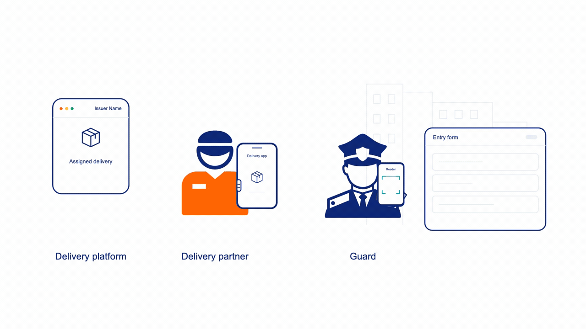

<!-- markdownlint-disable MD033 -->

<h1 align="center">Bharat Last-Mile ID</h1>

<p align="center">
  
</p>

<p align="center">
  <strong>Open Last-Mile Identity and Delivery Credential for Growing Digital India</strong>
</p>

<p align="center">
  <strong>Draft</strong> · Accepting comments
</p>

<p align="center">
  <a href="#proposal">Proposal</a> · <a href="#spec">Spec</a> · <a href="examples/integration-real-world-example/README.md">Sample Implementation</a>
</p>

<!-- markdownlint-enable MD033 -->

## Problem

Delivery partners frequently repeat their name, company, vehicle, and destination information at residential and commercial entrances. Security staff then type that information into a local system and apply the property's existing approval process. This workflow creates human queues, repeated work, transcription errors, wrong destination selections, and interruptions for residents.

### Existing solutions

Some solution already exists. For example,

- ADDA documents _Silent Approval_ for their users: residents can skip approval requests for selected delivery companies while still receiving informational entry notifications. That preference alone does not verify a visitor's company affiliation or delivery assignment.
- MyGate documents _Validated Entries_ through partner integrations: it receives assigned delivery-executive details from participating platforms, matches delivery information, and supports advance notifications and auto-approval. This adds issuer-supplied information to the workflow, but depends on the participating integrations.

The remaining problem is a common way for independently implemented systems to exchange a delivery assertion. Manual intake still causes **delays** and **mistakes** where integration is absent.

## Proposal



[View video](assets/common/verified-delivery-exchange.mp4)

LMID defines a small, signed QR credential displayed by an official delivery-partner application after pickup. A compatible reader can:

- verify which issuer signed the credential;
- display the issuer-verified delivery-partner name;
- read optional vehicle and photo information;
- receive one or more delivery destinations;
- reconcile those destinations with its local property directory; and
- auto-fill its existing entry workflow.

The reader remains optional. LMID does not replace guards, manual entry, resident approval, or local entry policy. An issuer can create a pass without knowing which reader product, if any, exists at the destination.

**Level 1 promises signed autofill while existing admission authority remains intact.**

LMID Level 1 supplies an issuer-signed delivery credential for local reconciliation and autofill. It separates resident preference, an authenticated issuer assertion, and verification of the presenter: the signature establishes the assertion's source and integrity, while a static QR does not prove that its presenter is the assigned worker. Existing approval and physical checks remain authoritative. Coordinating notifications across applications belongs to further Level 2 work.

### Adoption through existing platforms

Delivery platforms implement issuance in their existing applications, and gate-management vendors implement reading in theirs. Communities and residents are users of those systems; LMID requires no separate community onboarding, resident application, or protocol adoption decision. Credential exchange can be transparent within the existing workflow, while the property's admission authority and resident settings remain intact.

### Levels and recommended scope

Level 1, Level 2, and Level 3 name the specification's capability scope. Level 1 is the immediate adoption target. The existing Level 2 event work and future Level 3 considerations are preserved. The roadmap below does not add fields or change their current contracts.

Numeric wire-format identifiers remain separate: `lmid.v`, `versions_supported`, schema identifiers, and CloudEvents `specversion` retain their existing values. Supporting Level 2 does not mean changing a Level 1 pass to `v: 2`; Level 2 adds capabilities around that pass. Package and registry versions also identify their own formats or releases, not LMID levels.

| Level | Recommended scope |
| --- | --- |
| **Level 1: signed autofill** | Issuer-signed credential, discovery, issuer acceptance, local destination reconciliation, autofill, and manual fallback. Make everyday interactions easier while preserving existing admission authority. |
| **Level 2: feedback and improvements** | Feedback to issuers, improvements from Level 1 experience, cancellation and reassignment freshness, address correction, notification coordination, and better batch handling. Further define privacy and data-handling scope, including purpose limitation, transparency, retention, access controls, and reduced data exposure. |
| **Level 3: autonomous access** | Stronger holder and device verification, trusted hardware, current access authorization, safe automated gates, access zones, anti-tailgating, and optional facial verification and liveness checks. Further scope human override and physical-safety requirements. |

The optional `gate_check_in` profile is existing Level 2 design work, not the complete Level 2 scope. Additional Level 2 capabilities need further definition before implementation. Level 3 remains high-level future scope.

### Level 1 design

- A compact JWS presented on a QR Code Model 2, with error-correction level M.
- ES256 signature with issuer identity represented by a bare domain and key discovery over HTTPS.
- Domain-derived participant metadata containing display identity, roles, capabilities, and public-key location.
- Extensible provider-qualified place IDs.
- Optional issuer-provided photo reference and SHA-256 digest.
- Optional vehicle registration.

## Designed for independent implementation

LMID is designed for independent implementation by issuers and reader vendors. These answers describe the Level 1 cryptographic profile. First-time discovery requires network access. Issuer acceptance, destination matching, approval, and entry remain separate verifier-controlled decisions.

| Question | Answer |
| --- | --- |
| Can an issuer independently implement and publish passes? | **Yes.** |
| Can a verifier independently implement a reader? | **Yes.** |
| Can a reader automatically discover an unknown issuer from the QR when online? | **Yes.** |
| Does the protocol require bilateral technical integration? | **No.** Domain-based discovery supplies the protocol metadata; local issuer acceptance remains separate. |
| Does issuer acceptance remain under verifier policy? | **Yes.** |
| Is end-to-end cryptographic verification specified? | **Yes.** |
| Has interoperability between independent implementations been demonstrated? | **Not yet.** The current fixtures validate examples; independent issuer and reader implementations must demonstrate interoperability before it is claimed. |

## Spec

- [Level 1 Draft specification](spec/specification.md)
- [Level 2 `gate_check_in` event sub-specification](spec/gate-check-in-events.md)
- [Stakeholder benefits](benefits.md)
- [Test suite](tests/README.md)

## Machine-readable schemas

- [JWS protected header](schemas/lmid-jws-header.schema.json)
- [JWT Claims Set and `lmid` object](schemas/lmid-pass-payload.schema.json)
- [Participant metadata](schemas/lmid-participant-metadata.schema.json)
- [`gate_check_in` event](schemas/lmid-gate-check-in-event.schema.json)
- [Place-ID provider registry](schemas/place-id-provider-registry.schema.json)

The schemas use JSON Schema Draft 2020-12. The specification defines additional cross-field rules such as time ordering, maximum validity, unique delivery references, effective-destination sufficiency, Unicode normalization, and compact-token size.

## Ecosystem data

- [Registry field documentation](data/README.md)
- [Place-ID providers](data/place-id-providers.json)

LMID has no central partner registry. A participant's canonical domain is its identifier, and other participants derive its domain-controlled metadata location automatically. The place-ID provider data is informative parsing guidance and does not establish participant trust.

## Sample Implementation

The [JavaScript Swiggy issuer and ADDA reader](examples/integration-real-world-example/README.md) demonstrate the complete Level 1 flow: issue a signed pass, save its QR as a PNG, scan that file, discover issuer metadata and public keys over authenticated HTTPS, verify the credential, and reconcile its destination for autofill.

The default data uses Aparna Serene Park in Hyderabad, its supplied Google Place ID, building `R`, and flat `1204`. These are simulated services using reserved `.example` domains, not integrations with the named companies. The example documents [specification gaps and adopter challenges](examples/integration-real-world-example/IMPLEMENTATION-NOTES.md).

```sh
npm ci
npm run example:issue
npm run example:verify
```

## Examples and signed tests

Unsigned pass, event, and metadata examples are available in [`examples/`](examples/).

The [`tests/scenarios/`](tests/scenarios/) directory contains five Indian-context test cases. Each generated `case.json` includes the scenario description, fixed verification time, protected header, payload, compact token, and expected result.

Install the pinned dependencies and run the complete validation suite:

```sh
npm ci
npm test
```

`npm test` validates repository structure, JSON Schemas, generated-fixture consistency, compact JWS signatures, the signed HTTP webhook fixture, the JavaScript example, Markdown, and spelling. Signed conformance fixtures use fixed verification times. The executable example tests issue fresh passes using the current clock and run an isolated local HTTPS discovery service; they require OpenSSL 3 but no external service.

Regenerate signatures and case files only after intentionally changing scenario sources:

```sh
npm run fixtures:generate
npm test
```

The private key in `tests/keys/` is intentionally public test material. Never use it outside tests.

## Repository structure

This layout separates human-readable protocol text, machine-readable contracts, examples, maintained ecosystem data, and signed conformance tests.

```text
.
├── README.md
├── benefits.md
├── package.json
├── package-lock.json
├── spec/
│   └── specification.md
├── schemas/
│   ├── lmid-jws-header.schema.json
│   ├── lmid-pass-payload.schema.json
│   ├── lmid-participant-metadata.schema.json
│   ├── lmid-gate-check-in-event.schema.json
│   └── place-id-provider-registry.schema.json
├── data/
│   ├── README.md
│   └── place-id-providers.json
├── examples/
│   ├── integration-real-world-example/
│   ├── events/
│   ├── metadata/
│   └── passes/
└── tests/
    ├── README.md
    ├── generate-fixtures.mjs
    ├── validate-schemas.mjs
    ├── verify-fixtures.mjs
    ├── keys/
    ├── scenarios/
    └── webhooks/
```

### Folder responsibilities

- `spec/` contains the normative protocol specification.
- `schemas/` contains versioned JSON Schema contracts.
- `data/` contains optional place-ID parsing guidance that can grow without changing the signed pass shape.
- `examples/` contains explanatory payloads and a runnable JavaScript issuer and reader.
- `tests/` contains signed tokens, expected outcomes, public test keys, and deterministic validation tooling.

### Recommended future folders

Create these only when the corresponding work begins:

- `reference/`: reference issuer and reader libraries or prototype applications;
- `conformance/`: broader negative, discovery, and interoperability suites;
- `security/`: threat model, privacy assessment, and vulnerability-disclosure policy; and
- `rfcs/`: focused proposals for changes that are outside Level 1.

Future implementation code, security assessments, and formal conformance tooling remain separate from the protocol specification. The project should add licensing, contribution guidance, and governance before publishing a final standard.

## Responsibilities outside the protocol

Dispute resolution and security-incident response belong to the organizations operating the participating services and their existing processes. LMID does not define case handling, escalation ownership, or a dispute or incident-management service. Protocol requirements for signature verification and key handling remain part of the technical contract.
